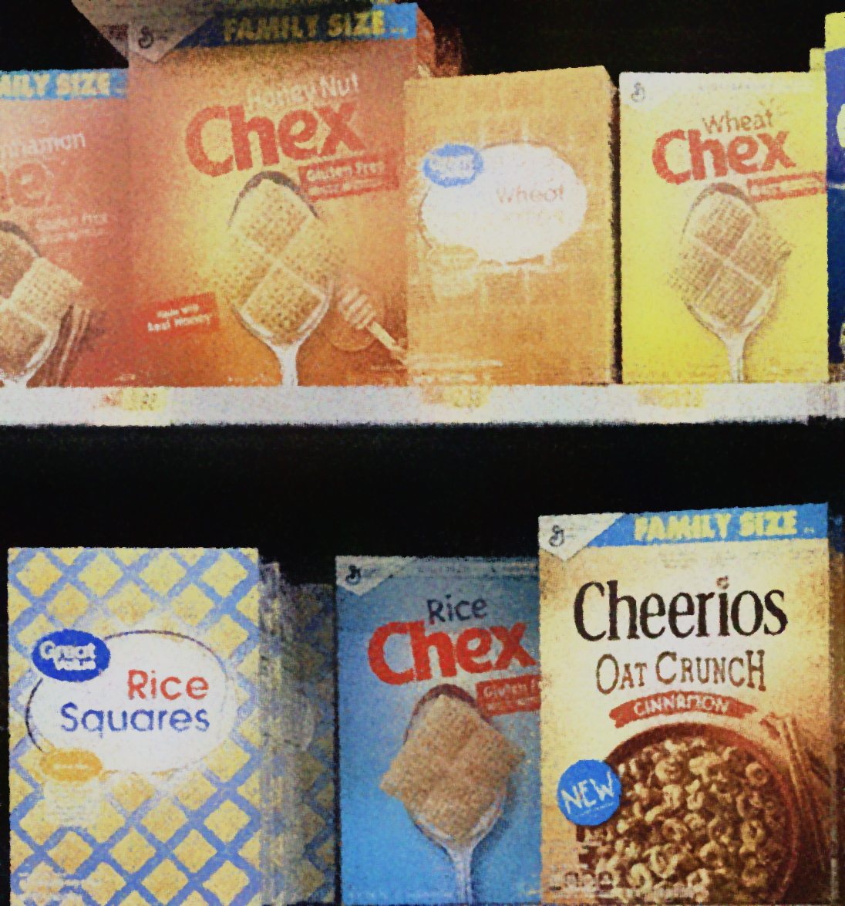

# Image Processing & Computer Vision
## Part 1 - Single and Multiple Instance Object Detection - Image Processing
**Instance Object Detection** was developed using different techniques, such as:

- SIFT, ORB
- Template Matching
- Double-checking using Color Histograms, Zero Mean Normalized Cross Correlation (ZNCC), etc.

### Single Instance Object Detection 
First, many different **models** were provided, such as:

and different **noisy scenese**, such as:

In the notebook available [here](./module1/assignment1.ipynb), a study on the best filters for denoising and how to tune their parameters was conducted. Once the denoising was applied, this is how it looks:   

At this point, an algorithm consisting of **SIFT and template matching**, customized to **handle occluded objects**, was used to filter out incorrect detections. Below is an example of an occluded object that has been correctly detected:  

### Multiple Instances Object Detection 
The same approach as for single instance detection was applied, but for multiple instance object detection. This time, the algorithm is slightly more complex than the one in the first part, utilizing additional criteria for double-checking SIFT detections, comparing **color distributions**, and using **similarity functions**. An example is shown below:

## Part 2 - Product Classification 
Implementation of a neural network that classifies smartphone pictures of products found in grocery stores. It's divided into two parts: first, implementation from scratch of my own **neural network** for image classification; then, you **fine-tuning** of a **pretrained network** provided by PyTorch.

### Neural Network from Scratch

A **VGG-like architecture** was developed, and **preprocessing** was applied to the data. Techniques such as **Dropout Regularization, Global Average Pooling, Batch Normalization, an Adam learning rate scheduler, and LeakyReLU as the activation function** were utilized to achieve higher accuracy. We achieved an accuracy of approximately 67.5% on the test set.

Loss and Accuracy over Validation Set during training:

### ResNet-18 Pre-Trained
A **pre-trained ResNet-18** model on ImageNet-1k (V1) was used and **fine-tuned**. By adjusting fine-tuning parameters, changing the image resolution, applying data augmentation and weight decay, and experimenting with freezing layers, we managed to achieve approximately 88% accuracy on the Test Set!

Loss and Accuracy over Validation Set during training:

 
Example of classification:  

